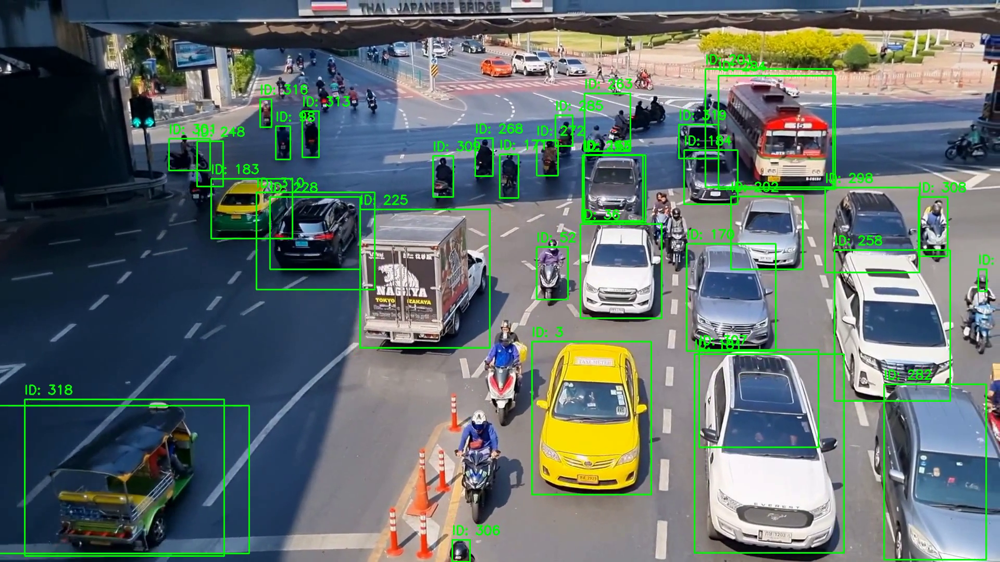

# Object Tracking in Videos using YOLOv5 and DeepSORT

## Project Overview

This project implements a multi-object tracking system for video footage using YOLOv5 for object detection and DeepSORT for object tracking.

The system detects multiple moving objects in each video frame and assigns persistent tracking IDs so that the same object can be followed across consecutive frames.
## Demo Videos

### Original Traffic Footage
This is the raw input traffic video used for object detection and tracking.

[Watch Input Traffic Video]((https://youtu.be/kjaPdOXvlOI))

---

### YOLOv5 + DeepSORT Tracking Output
This video demonstrates the final multi-object tracking output. Vehicles and motorbikes are detected using YOLOv5 and tracked across frames using DeepSORT with persistent tracking IDs.

[Watch Tracking Output Video]((https://youtu.be/ermJYtpII7s))
## Objective

The objective of this project is to build an end-to-end computer vision pipeline that can:

- Detect objects in video frames
- Track objects across time
- Assign unique IDs to each tracked object
- Generate an output video with bounding boxes and tracking IDs

## Technologies Used

- Python
- OpenCV
- PyTorch
- YOLOv5
- DeepSORT
- Google Colab

## Dataset / Input Video

A short traffic video was used as input. The video contains multiple moving vehicles and motorbikes, making it suitable for testing multi-object tracking.

## Methodology

1. Loaded the input video using OpenCV
2. Applied YOLOv5 object detection frame-by-frame
3. Extracted bounding boxes, confidence scores, and class IDs
4. Passed detections into DeepSORT
5. Assigned tracking IDs to detected objects
6. Drew bounding boxes and IDs on each frame
7. Saved the final tracked output video

## Results

The model successfully detected and tracked multiple vehicles and motorbikes across the video.

Each tracked object was assigned a unique ID, allowing object movement to be followed across frames.

### Sample Output

## Key Observations

- YOLOv5 detected multiple traffic objects accurately in most frames.
- DeepSORT maintained object identities across consecutive frames.
- Tracking worked well in a busy road scene with several moving objects.
- Some ID switching may occur when objects overlap, become partially hidden, or move out of frame.

## Conclusion

This project demonstrates an end-to-end object tracking pipeline using YOLOv5 and DeepSORT. The system is suitable for basic traffic monitoring, surveillance, and video analytics applications.

## Future Improvements

- Use YOLOv8 for improved detection performance
- Use a larger benchmark dataset such as MOT17
- Add quantitative tracking metrics such as MOTA, MOTP, and IDF1
- Improve tracking under occlusion and dense traffic conditions
- Deploy the system as a real-time video tracking application
